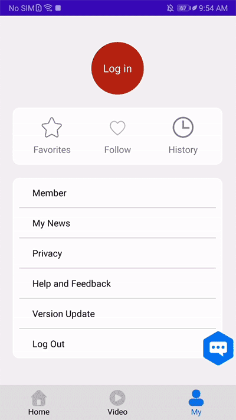
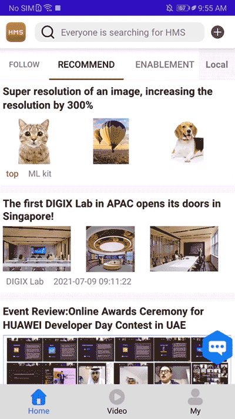
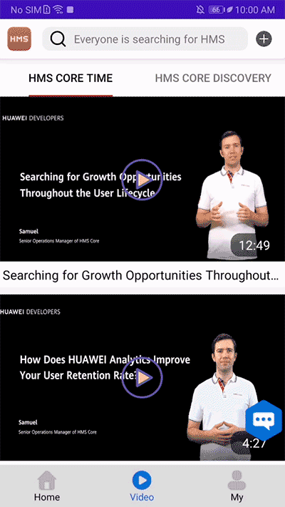
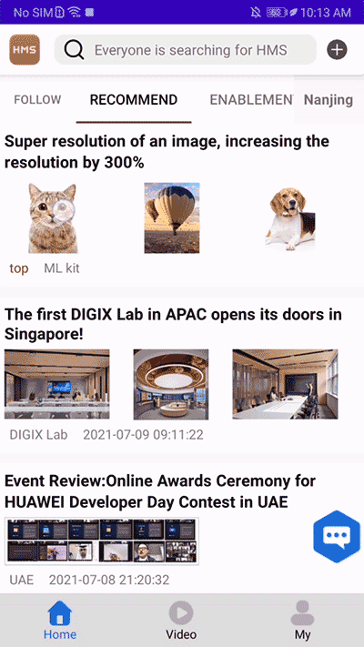
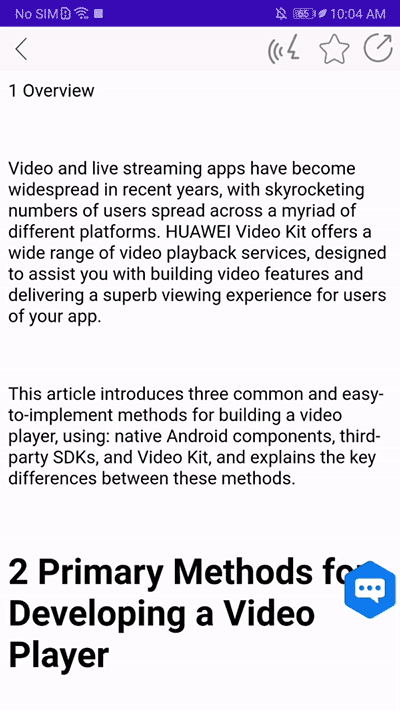
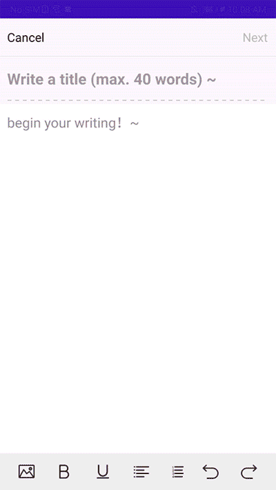
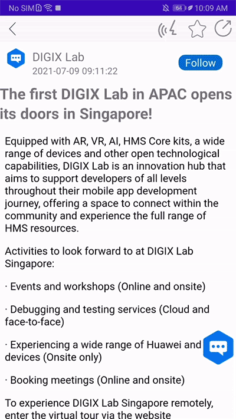
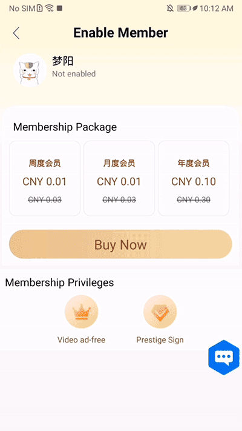

# HMS Core News Demo App

[中文](README_ZH.md)|English| [Overview](#overview) | [Download](#download) | [Features](#features) | [Application Generation](#application-generation) | [Service Introduction](#service-introduction) | [Technical Support](technical-support) | [Licensing and Terms](licensing-and-terms)

## Overview

The HMS Core news demo app demonstrates the process from releasing news through to display and consumption. This demo will help you learn how to integrate the capabilities of HMS Core into news apps and in which scenarios can these capabilities, like ML Kit, Push Kit, and Account Kit, play a part.

HMS Core provides an innovative solution for news apps to improve user experience, boost user engagement, and achieve sustainable business growth.

## Download

Firstly choose the area you are in, then you can use a browser to scan the QR code and download a local version of the demo app. 

<table><tr>
<td>

China

</td>
<td>

Asia, Africa, and Latin America

</td>
<td>

Europe

</td>
<td>

Russia

</td>
</tr></table>

## Features

The HMS Core news demo app includes the major functions of news apps, such as:

- Recommended news articles

- News by category

- Video

- Audio narration

- Editing and publishing news

- Voice Search

- Saving news to favorites and sharing them

- Reading history

- News push

- One-tap sign-in and sign-out

- Membership purchase

- Ads display

## Application Generation

**Environment Requirement**

- Android Studio: 4.1
- Android SDK: 26
- Gradle: 6.3

**Run locally**

1. Clone the repository:
  
        git clone https://github.com/HMS-Core/hms-news-demo.git

You can also download the ZIP package that contains the project.

2. Copy JKS file and **agconnect-services.json** to the app directory. For details about how to generate the files, please refer to [Configuring App Information in AppGallery Connect](https://developer.huawei.com/consumer/en/doc/development/HMSCore-Guides/config-agc-0000001050196065?ha_source=hms7).

3. Update JKS file information and app ID in app/build.gradle file.

4. Cloud Storage is used in the demo. As Cloud Storage is still in beta, you need to send an email to  agconnect@huawei.com to reqeust to [enable this service](https://developer.huawei.com/consumer/en/doc/development/AppGallery-connect-Guides/agc-cloudstorage-apply-0000001091904284?ha_source=hms7). 

5. Build the application from the command line:

        cd hms-news-demo
        gradle clean
        gradle build

## Service Introduction

- Account Kit allows your users to quickly sign in to your app with their HUAWEI IDs. These IDs will be used for as long as the users use your app.

  

- Ads Kit enables ads display. When your app is launched, this kit is called and the app will display a splash ad. When a user browses news on your app, the native ad is displayed in the feed, and before videos are played, a pre-roll ad will appear.

  

  

- When a user follows an account on your app, Push Kit is called to push another news story published by the same account.

- Video Kit provides video-related functions, including video playback/pause, progress bar dragging, and full-screen playback.

  

- Location Kit helps you obtain user location to display local news.

- ML Kit supports image super-resolution, text translation, and audio narration.

  

- Image Kit can be used to edit images in the news editing scenarios, including image cropping and adding filters and stickers.

  

- App Linking allows your users to share news with their friends.

  

- In-App Purchases allows your users to purchase membership services and provides them with membership rights.

  

- Analytics Kit can obtain statistics about news consumption (loading and reading) so that you can analyze the app usage data and optimize the app accordingly.

## Precautions

- Purchasing subscriptions in the app will deduct money from the user's account. But the deduction will be refunded immediately.
- This app allows users to sign in using their HUAWEI IDs and obtains the profiles and names of their accounts for in-app display.
- All ads in the app are test ads.

## Technical Support
If you want to evaluate more about HMS Core, [HMS Core on Reddit](https://www.reddit.com/r/HuaweiDevelopers/) is for you to keep up with latest news about HMS Core, and to exchange insights with other developers.

If you have questions about the sample project, try the following options:
- [Stack Overflow](https://stackoverflow.com/questions/tagged/huawei-mobile-services) is the best place for any programming questions. Be sure to tag your question with 
`huawei-mobile-services`.
- [Huawei Developer Forum](https://forums.developer.huawei.com/forumPortal/en/home?fid=0101187876626530001?ha_source=hms7) HMS Core Module is great for general questions, or seeking recommendations and opinions.

If you run into a bug in sample project, please submit an [issue](https://github.com/HMS-Core/hms-news-demo/issues) to the Repository. Even better you can submit a [Pull Request](https://github.com/HMS-Core/hms-news-demo/pulls) with a fix.

## Licensing and Terms
The HMS Core News Demo App is licensed under the [Apache 2.0 license](https://github.com/HMS-Core/hms-news-demo/blob/main/LICENSE).
