# HMS Core 新闻垂域Demo App

中文 | [English](README.md)| [Demo简介](#demo简介) | [Demo 下载](#demo下载) | [基本功能](#基本功能) | [运行步骤](#运行步骤) | [Kit使用描述](#kit使用描述) | [技术支持](#技术支持)

## Demo简介

HMS Core新闻垂域Demo App演示了本地发布、新闻展示及新闻阅读的全过程。此Demo将帮助开发者了解如何在新闻类应用中集成HMS Core的各项能力以及这些能力的具体使用场景，如机器学习服务、推送服务、帐号服务等。

HMS Core为新闻阅读类应用提供了创新的解决方案，帮助开发者提升应用体验，增强用户粘性，实现可持续的业务增长。

## Demo下载

选择对应的区域，使用浏览器扫描对应的二维码，便可以下载Demo应用。

<table><tr>
<td>

<p>中国</p>
</td>
<td>

<p>亚非拉</p>
</td>
<td>

<p>欧洲</p>
</td>
<td>

<p>俄罗斯</p>
</td>
</tr></table>

## 基本功能

HMS Core新闻垂域Demo涵盖了目前主流新闻类App中常用的功能，具体功能如下：

- 推荐新闻阅读
- 新闻分类查看
- 视频新闻观看
- 语音朗读新闻
- 本地新闻展示
- 新闻/语音搜索
- 新闻内容收藏与分享
- 新闻浏览历史
- 新闻内容推送
- 新闻编辑与发布
- 一键登录登出
- 会员功能
- 广告投放
- 版本更新提示

## 运行步骤

**环境要求**

- Android Studio: 4.1
- Android SDK: 26
- Gradle: 6.3

**本地运行**

1. 克隆代码仓:

   ```
    git clone https://github.com/HMS-Core/hms-news-demo.git
   ```

您也可以下载包含该项目的Zip包。

1. 将您的jks文件和agconnect-services.json文件拷贝到app目录。关于jks和agconnect-services.json的生成可以参考：[配置AppGallery Connect](https://developer.huawei.com/consumer/cn/doc/development/HMSCore-Guides/config-agc-0000001050196065?ha_source=hms7)

2. 在app/build.gradle文件中更新您的jks文件信息及Application ID。

3. 由于云存储服务当前仍处于Beta开放状态，在使用此服务前，您需要向agconnect@huawei.com发送申请邮件，申请开通云存储服务。

4. 在命令行中编译应用程序：

   ```
    cd hms-news-demo
    gradle clean
    gradle build
   ```

## Kit使用描述

- Account Kit帮助用户直接使用华为帐号一键登录，并在后续的App使用过程中用到该帐号。

  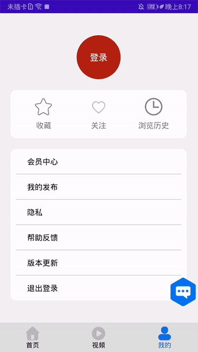

- 当刚打开App时，会调用Ads Kit并展示开屏广告；在浏览新闻时，信息流中会展示原生广告；播放视频新闻前，会展示贴片广告。

  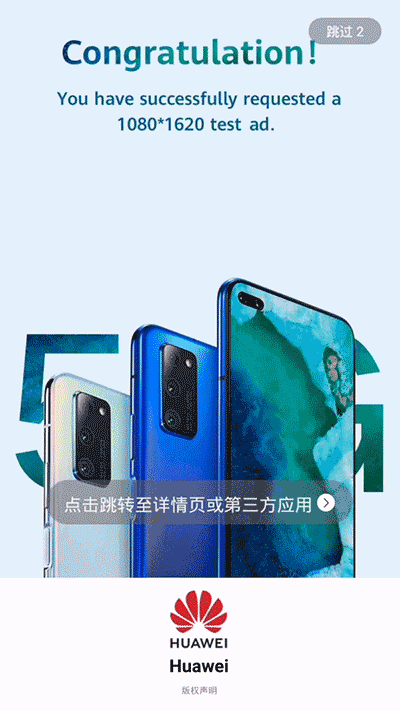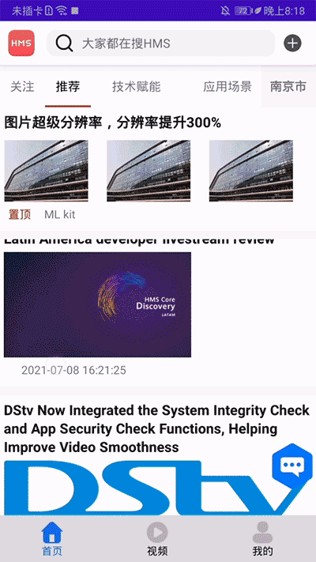

  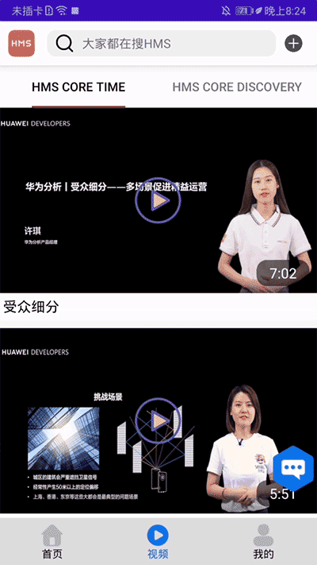

- 当用户关注某帐号时，Push Kit会推送另一篇该帐号发布的新闻。

- Video Kit提供播放视频的能力，包括播放、暂停、拖动、全屏播放等播放控制功能。

  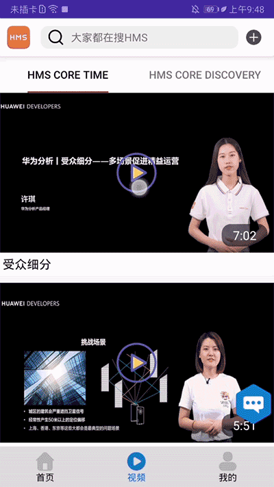

- Location Kit获取用户所在位置并展示本地新闻。

- ML Kit提供图片超分、文本翻译、新闻朗读、语音搜索等功能。

  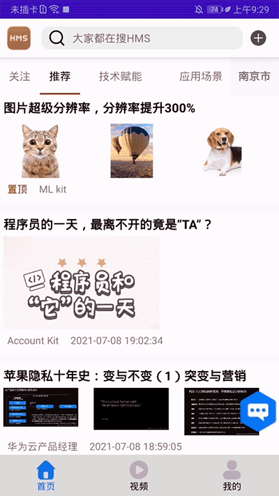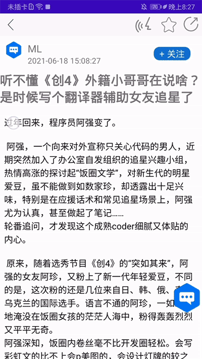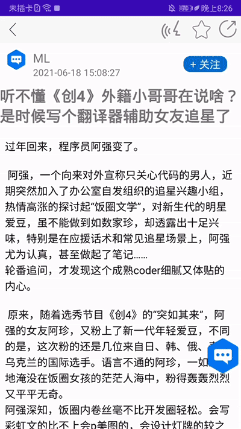

  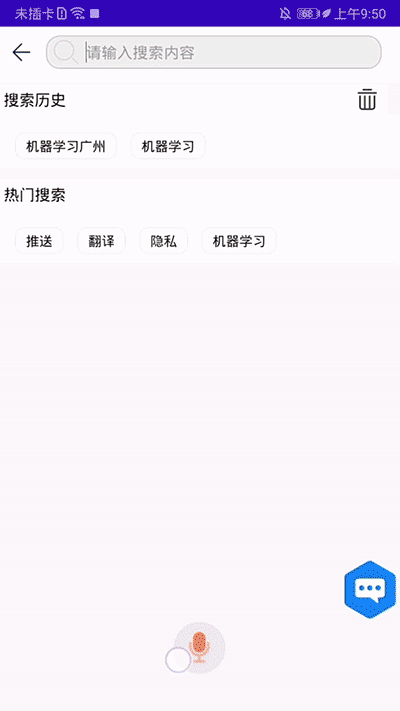

- 编辑新闻时，使用Image Kit相关能力对图片进行美化，包括剪裁图片、选择滤镜、添加贴纸。

  

- App Linking分享新闻给好友。

  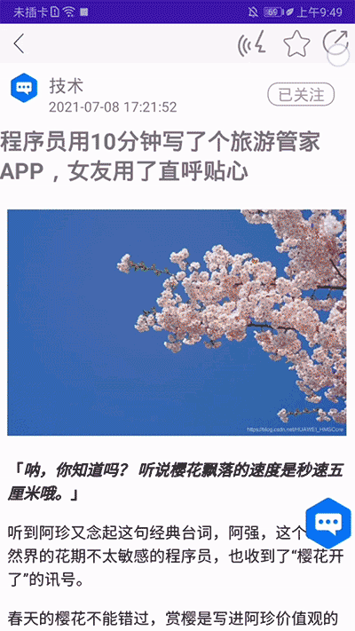

- IAP Kit可以帮助用户进行会员关系的订购，以提供会员优惠。

  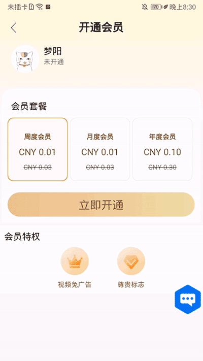

- Analytics Kit可以获取统计上报新闻加载，阅读的情况，以分析统计App的使用数据，供开发者进行优化。

## 注意事项

- App中的会员订购为真实订购，将会从您的帐户中进行实际扣费，并且不会退费。会员订购完成后请及时通过“订阅管理”取消订购，否则将会导致持续扣费。取消订购后当前会员关系将保持到周期结束。
- App中登录的帐户为手机中的华为帐号。App将获取帐号中的头像及帐号名用于App中的展示。
- App中的广告为测试广告。

## 技术支持

如果您想更多的了解HMS Core，欢迎您来到[HMS Core on Reddit](https://www.reddit.com/r/HuaweiDevelopers/) 获取最新的HMS Core的信息，并且和更多的开发者一起进行交流。

如果对使用该样例项目仍然存在疑问，欢迎通过以下渠道告诉我们：
- 建议在[Stack Overflow](https://stackoverflow.com/questions/tagged/huawei-mobile-services) 中反映开发编程中的问题。请给您的问题打上 `huawei-mobile-services`的标签。
- 建议在[华为开发者论坛](https://developer.huawei.com/consumer/cn/forum/block/hms-core?ha_source=hms7) HMS Core板块中反馈其他问题，或者搜索相关建议和意见。

如果您在样例工程中发现Bug，欢迎您在 [issue](https://github.com/HMS-Core/hms-news-demo/issues) 中反馈给我们。同时欢迎您直接提交进行修改[Pull Request](https://github.com/HMS-Core/hms-news-demo/pulls) 。

## Licensing and Terms
HMS Core新闻垂域Demo使用 [Apache 2.0 license](https://github.com/HMS-Core/hms-news-demo/blob/main/LICENSE).